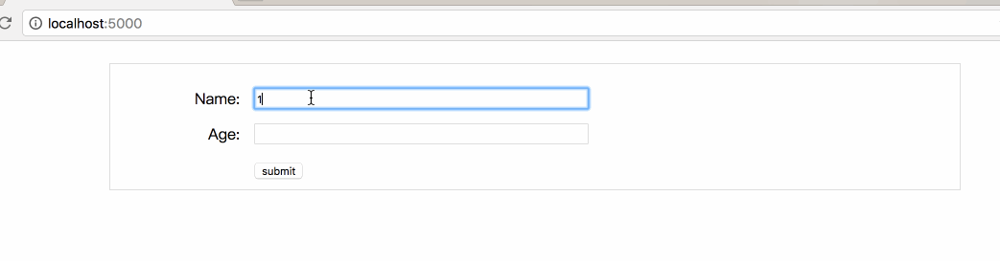

# React-validator
React-validator is a feature rich and multi plugin that makes it easy to validate user input for React component 
while keeping your code without without wrapper components or wrapper function.

# Installation
```js
npm install react-validator-jq
```

# Simple Example
```js
import React, {Component} from 'react';
import './simple-form.less';
import FormWrapper from '../dist/form';

class SimpleForm extends Component {
    constructor(props) {
        super(props);
        this.state = {
            errors: null
        }
    }

    onChange(e, error, name) {
        console.log(e.target.value);
        console.log('error: ', JSON.stringify(error));
        if (error) {
            this.setError(error);
        }
        else {
            this.removeError(name);
        }

    }

    setError(error, force) {
        const errors = force ? {} : (this.state.errors || {});
        if (error && error.length) {
            error.forEach(err => {
                errors[err.field] = err.message;
            })
        }
        this.setState({errors});
    }

    removeError(name) {
        const errors = this.state.errors;
        if (errors && errors[name]) {
            errors[name] = null;
            this.setState(errors);
        }
    }

    onSubmit() {
        console.log('validate ....');
        const setError = this.setError.bind(this);
        this.validate((error, data) => {
            setError(error, true);
            console.log('form data: ', data);
        });
    }

    render() {
        const errors = this.state.errors;
        return (
            <form className="form">
                <section className="form-item">
                    <label>Name:</label>
                    <input name="name"
                           onChange={this.onChange.bind(this)}
                           type="text"
                           data-validation={[{required: true}]}/>
                    <span className="error">{errors && errors.name ? errors.name : ''}</span>
                </section>
                <section className="form-item">
                    <label>Age:</label>
                    <input name="age"
                           type="text"
                           data-validation={[{required: true}]}/>
                    <span className="error">{errors && errors.age ? errors.age : ''}</span>
                </section>
                <footer className="form-action">
                    <button type="button" onClick={this.onSubmit.bind(this)}>submit</button>
                </footer>
            </form>
        );
    }
}

export default FormWrapper(SimpleForm);
```
Demo Effect:

;